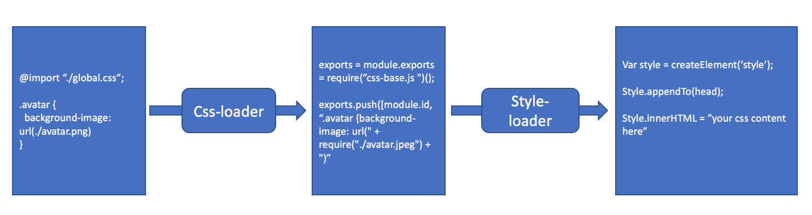
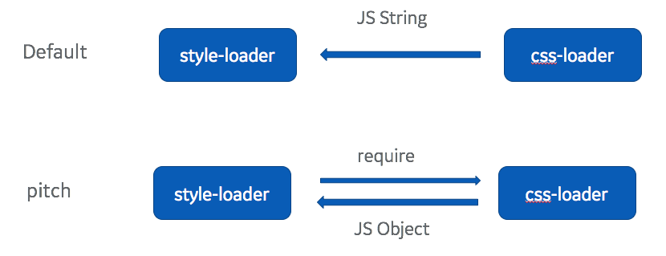
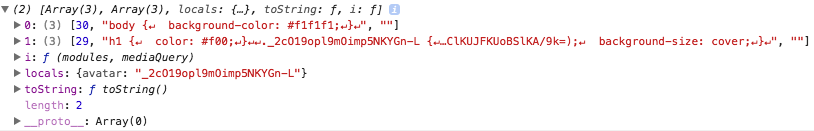

# webpack 源码解析三：详解 style-loader 和 css-loader

# style-loader 和 css-loader 是如何工作的

上面讲了如何写一个简单的 `babel-loader`，那么如果我们需要加载css，应该怎么实现呢？我们一般css的loader都是这么配置的：

```js
{
  module: {
    rules: [
      {
        test: /\.css$/,
        use: [
          { loader: "style-loader" },
          { loader: "css-loader" }
        ]
      }
    ]
  }
}
```
即我们的CSS代码会先被 `css-loader` 处理一次，然后再交给 `style-loader` 进行处理。那么这两步分别是做什么呢？
1. css-loader 的作用是处理css中的 `@import` 和 `url` 这样的外部资源
2. style-loader 的作用是把样式插入到 DOM中，方法是在head中插入一个style标签，并把样式写入到这个标签的 innerHTML 里

画一张示意图来表示：



这也是webpack的哲学，即一个loader只做一件事。我们对图片等资源的处理和把样式插入到DOM分为两个任务，这样每个loader做的事情就比较简单，而且可以通过不同的组合实现更高级的功能。

# style-loader 原理解析
`style-loader` 的主要作用就是把 CSS  代码插入DOM中，我们看看他的代码。style-loader 的主要一段代码如下所示：

```js
module.exports.pitch = function (request) {
    return [
        "var content = require(" + loaderUtils.stringifyRequest(this, "!!" + request) + ");", // 获取 CSS 文件的内容
        "if(typeof content === 'string') content = [[module.id, content, '']];",
        "// Prepare cssTransformation",// 省略无关内容
        "// add the styles to the DOM",
        "var update = require(" + loaderUtils.stringifyRequest(this, "!" + path.join(__dirname, "lib", "addStyles.js")) + ")(content, options);", // 调用 addStyles ，把CSS内容插入到DOM中去
        "if(content.locals) module.exports = content.locals;", // 支持 css modules，如果启用了 css modules，class的映射就放在 content.locals 中，因此直接默认导出，我们 import 的时候就会得到一个映射字典。
        options.hmr ? hmrCode : ""
    ].join("\n");
}
```

它其实就是返回了一段JS代码，这段代码主要就分为两步：
1. 通过 require 来获取CSS文件的内容，得到是一个字符串
2. 调用 addStyles 把CSS内容插入到 DOM中去

这里面有几个地方需要着重讲一下：

**pitch 方法是什么？**

默认模式和pitch模式区别，如下图所示：



正常情况下，我们会用 default 方法，那么这里我们为什么用一个 pitch 方法呢？pitch 方法有一个官方的解释在这里 [pitching loader](https://webpack.js.org/api/loaders/#pitching-loader)。简单的解释一下就是，默认的loader都是从右向左执行，用 pitching loader 是从左到右执行的。

这里我们为什么用 pitching loader呢？因为我们要把CSS文件的内容插入DOM，所以我们要获取CSS文件的样式。如果按照默认的从右往左的顺序，我们使用 css-loader ，它返回的结果是一段JS字符串，这样我们就取不到CSS样式了。为了获取CSS样式，我们会在 `style-loader` 中直接通过require来获取，这样返回的JS就不是字符串而是一段代码了。也就是我们是先执行`style-loader`，在它里面再执行 `css-loader`。 同样的字符串，但是在默认模式下是当字符串传入的，在pitching模式下是当代码运行的，就是这个区别。


也就是，我们处理CSS的时候，其实是 styled-loader先执行了，它里面会调用 css-loader 来拿到CSS的内容，拿到的内容当然是经过css-loader 编译过的。

*需要提的一点是，其实 css-loader 返回的也不是css的内容，而是一个对象，不过他的 `toString()` 方法会直接返回css的样式内容，那么为什么是这样的呢，因为这个是 `css-loader` 返回的结果，请继续往下阅读*

**感叹号是干什么的**
参考 https://webpack.github.io/docs/loaders.html#loader-order 文档的说明，感叹号是用来忽略loader配置的。因为我们的 `style-loader` 是用来加载 `css` 文件的，如果不忽略配置会出现无限递归调用的情况。即 style-loader 里面调用了 `require(‘xxx.css’)` ，这个require又会去调用 style-loader，于是就无限循环了。

**loaderUtils.stringifyRequest**
这个方法是把绝对路径转成相对路径的，参考 这个文档的说明 [https://github.com/webpack/loader-utils](https://github.com/webpack/loader-utils)。注意他返回的字符串已经带了引号了。

**addStyle做了什么**
可以直接读 [style-loader](https://github.com/webpack-contrib/style-loader) 的源码，其实 addStyle 做的核心的事情就是在head中插入了一个 style标签，并把 CSS 内容写入这个标签中。

# 自己实现一个 style-loader

我们如果自己写一个简陋的 style-loader，代码也非常简单，10行代码就可以写出来：

*style-loader.js*

```js
module.exports.pitch = function (request) {
  var result = [
    'var content=require(' + loaderUtils.stringifyRequest(this, '!!' + request) + ')’, // 得到 css 内容
    'require(' + loaderUtils.stringifyRequest(this, '!' + path.join(__dirname, "add-style.js")) + ')(content)’, // 调用  addStyle 把CSS内容插入到DOM中
    'if(content.locals) module.exports = content.locals’ // 如果发现启用了 css modules，则默认导出它
  ]
  return result.join(';')
}
```
*add-style.js*
```js
module.exports = function (content) {
  var style = document.createElement("style")
  style.innerHTML = content
  document.head.appendChild(style)
}
```
# css-loader 原理解析

下面解析一下 css-loader 是如何工作的。首先，css-loader 就不是一个 pitching loader 了，因为如果我们有 `less-loader` ，它会把 less 代码编译成 css代码，并传给 css-loader，所以用默认的模式就可以了。

那么为什么要有 `css-loader` 呢？，从两个方便解释：
1. `style-loader` 中调用了 `require` 去加载css文件，如果我们不用一个 `css-loader`，那么这里会直接报错 “没有css文件对应的loader"
2. `style-loader` 只负责插入CSS，那么CSS中的 `@import` 和 `url` 语句还是需要 `css-loader` 去解析的。
3. 另外，modules 等也是在 css-loader 上实现的

可见，相比 `style-loader`，`css-loader` 要复杂得多。

现在假设我们有两个文件，分别是：

*style.css*
```css
@import './global.css';
h1 {
  color: #f00;
}

.avatar {
  width: 100px;
  height: 100px;
  background-image: url('./avatar.jpeg');
  background-size: cover;
}
```
*global.css*
```css
body {
  background-color: #f1f1f1;
}
```

 css-loader 会执行两次，因为有两个文件，每一个css文件的处理，比如 `style.css` 的处理会包括两部分：
1. 把 `@import` 替换成 `require("-!../node_modules/css-loader/index.js!./global.css")`， `-!` 语法会禁用掉 preLoader 和 loader，因此这一个require并不会递归调用自己。
2. 把 `background-image: url('./avatar.jpeg’)` 替换成 `"background-image: url(" + require("./avatar.jpeg") + “)"`，图片的处理比较简单，因为如何加载图片，这是另一个loader的事情，`css-loader` 不负责这部分，他只需要关心把 `url` 转换成 `require` 就可以了。
简单的概括，就是把这两种CSS内部的依赖，替换成 JS 的语法 `require`，这样webpack就能正确处理了。


我们看一下 `css-loader` 处理 `style.css` 之后返回的代码：

```js
exports = module.exports = require("../node_modules/css-loader/lib/css-base.js")(undefined); // 这里其实返回了一个数组。
// imports
exports.i(require("-!../node_modules/css-loader/index.js!./global.css"), ""); //对另一个CSS文件的依赖

// module
//想默认导出的数组中加入了一个数组，分别存了 `module.id` 和 css的内容
exports.push([module.id, "h1 {\n  color: #f00;\n}\n\n.avatar {\n  width: 100px;\n  height: 100px;\n  background-image: url(" + require("./avatar.jpeg") + ");\n  background-size: cover;\n}\n", ""]);

// exports
// 显然是 modules 模式的时候用的一个名字映射
exports.locals = {
    "avatar": "_2cO19opl9mOimp5NKYGn-L"
}
```

因为 css-base 中的方法执行后返回一个数组，所以上面这段代码执行之后显然会返回一个数组，同时调用了数组上的 `i` 和 `push` 方法，可以发现 `i` 方法是用来处理 `@import` 的。而当前模块的内容就直接被push进了这个数组。
*这里需要提醒自己，上述代码的生成，是在webpack中，也就是nodejs中的，但是这段代码的执行，就是在浏览器中了。*

下面我们逐行解析上面的四段代码：

```js
exports = module.exports = require("../node_modules/css-loader/lib/css-base.js")(undefined); 
```
这里返回的是一个数组，并且定义了 `i` 方法可以添加依赖模块，以及重置了 `toString`方法默认返回css内容。

```js
exports.i(require("-!../node_modules/css-loader/index.js!./global.css"), "");
```
`i` 方法其实就是把一个CSS模块push到数组中，因为这里我们的 `style.css` 依赖 `global.css` 所以需要加入这个依赖

```js
exports.push([module.id, "h1 {\n  color: #f00;\n}\n\n.avatar {\n  width: 100px;\n  height: 100px;\n  background-image: url(" + require("./avatar.jpeg") + ");\n  background-size: cover;\n}\n", ""]);
```
把自己的内容也加进去。其实 `exports.i` 执行的和上面这个代码类似，不过是加入的别的模块。

```js
exports.locals = {
    "avatar": "_2cO19opl9mOimp5NKYGn-L"
}
```
在 `style-loader` 中也提到过了，如果启用了 css modules，那么我们就需要一个 classname的映射表，因此这里直接放在 `exports.locals` 中，传给 `style-loader`，而 `style-loader` 发现有 `locals` 就会默认导出它。最终我们 `import styles from “styles.css"` 的时候就得到了这个 `locals` 映射表。

这四段代码执行完之后，exports 就变成了这样：



其中的 `toString` 方法会把所有依赖 `map` 一遍并合并成一个大的字符串，也就是所有的CSS内容了，有兴趣的话可以直接看看 `css-base.js` 的代码，比较易懂。

## css-loader 源码解析

css-loader 的主要代码包含这两部分：

* `processCss.js` 中会调用 `postcss` 对 css 源码进行解析，然后遍历其中的 declaration 并抽离出 `url` 和 `import` 这两种依赖
* `loader.js` 会调用 processCss，根据它已经分析出的 url 和 import 依赖关系，在对应的代码中替换成 `require`，并拼接成段最终的JS返回

另外 还包含了 调用 postcss 相关的模块对CSS新特性的编译，对 sourcemap 的处理等。

下面我们分析一下最重要的两个函数，分别是 `processCss` 中对css进行依赖分析，和 `loader` 中根据分析结果生成最终JS代码。

其实所有逻辑都是围绕着 `import` 和 `url` 两种依赖关系展开的，这里为了逻辑上的清晰，省略了部分代码，如果要看完整代码建议看官方的代码 https://github.com/webpack-contrib/css-loader

*processCss.js 中 parserPlugin 代码分析*

```js

// parsePlugin 调用 postcss 对css代码进行语法分析，然后把其中的 `@import` 和 `url` 两种依赖收集起来，url 还会被替换成一个占位符
var parserPlugin = postcss.plugin("css-loader-parser", function(options) {
    return function(css) {
        var imports = {};
        var exports = {};
        var importItems = [];
        var urlItems = [];
        // 省略了一些不重要的代码
        if(options.import) {
            css.walkAtRules(/^import$/i, function(rule) {
                // 省略代码，这里主要收集 import 依赖，并存入 importItems 中
                // 在我们的这个示例项目中，最终 importItems 就是 [ { url: './global.css', mediaQuery: '' } ]
           });
        }


        // 最重要的函数，这里处理每一条样式声明
        // 如果发现
        function processNode(item) {
            switch (item.type) {
                case "value":
                    item.nodes.forEach(processNode);
                    break;
                case "nested-item":
                    item.nodes.forEach(processNode);
                    break;
                case "item":
                    // 这一块没太懂，因为如果是 `@import ‘xxx.css’` 其实并不是在这里处理的，而是在 上面的 css.walkAtRule 就处理了
                    var importIndex = imports["$" + item.name];
                    if (typeof importIndex === "number") {
                        item.name = "___CSS_LOADER_IMPORT___" + importIndex + "___";
                    }
                    break;
                case "url":
                    // 如果是一个url，比如 `background-image: url(./xxx.png)` 那么 就把 这个依赖记录到 urlItems 中，同时把 `xxx.png` 替换成一个 占位符 `___CSS_LOADER_URL___i___`
                    if (options.url && item.url.replace(/\s/g, '').length && !/^#/.test(item.url) && (isAlias(item.url) || loaderUtils.isUrlRequest(item.url, options.root))) {
                        // Don't remove quotes around url when contain space
                        if (item.url.indexOf(" ") === -1) {
                            item.stringType = "";
                        }
                        delete item.innerSpacingBefore;
                        delete item.innerSpacingAfter;
                        var url = item.url;
                        item.url = "___CSS_LOADER_URL___" + urlItems.length + "___";
                        urlItems.push({
                            url: url
                        });
                    }
                    break;
            }
        }
        
        // 遍历所有的样式声明，比如 `color: red` 就是一个 decl
        // 对每一条样式都调用 processNode 进行处理
        css.walkDecls(function(decl) {
            var values = Tokenizer.parseValues(decl.value);
            values.nodes.forEach(function(value) {
                value.nodes.forEach(processNode);
            });
            decl.value = Tokenizer.stringifyValues(values);
        });
        css.walkAtRules(function(atrule) {
            if(typeof atrule.params === "string") {
                atrule.params = replaceImportsInString(atrule.params);
            }
        });

        options.importItems = importItems;
        options.urlItems = urlItems;
        options.exports = exports;
    };
});
```

*loader.js*

```js
// processCss 已经解析出了依赖，那么在这里我们就要把这些依赖替换成 `require` ，这样webpack就能处理了。
processCss(content, map, {
        mode: moduleMode ? "local" : "global", // 是否启用 css modules
         // 省略...
    }, function(err, result) {
        if(err) return callback(err);

        var cssAsString = JSON.stringify(result.source);

        // for importing CSS
        var importUrlPrefix = getImportPrefix(this, query);

        var alreadyImported = {};
        // 这里开始处理 importItems 中记录的依赖，比如 对 `global.css` 的依赖
        var importJs = result.importItems.filter(function(imp) {
            // 因为很可能同一个模块会被多次依赖，所以要去重一下。
            if(!imp.mediaQuery) {
                if(alreadyImported[imp.url])
                    return false;
                alreadyImported[imp.url] = true;
            }
            return true;
        }).map(function(imp) {
            // 对于新的依赖，就在这里处理
            if(!loaderUtils.isUrlRequest(imp.url, root)) {
                // 如果不是一个文件的依赖，比如你是对一个线上资源的依赖，那么就会进到这里，这样就直接把它编译成css 的import语句。这样最终还是在浏览器中去加载这个远程的资源。
                return "exports.push([module.id, " +
                    JSON.stringify("@import url(" + imp.url + ");") + ", " +
                    JSON.stringify(imp.mediaQuery) + "]);";
            } else {
                // 如果是对一个文件的依赖，那么我们不用把它编译成css import ，而是直接替换成 `require`，webpack 会最终直接把依赖的文件内容打包进来了，不会存在 css import
                var importUrl = importUrlPrefix + imp.url;
                return "exports.i(require(" + loaderUtils.stringifyRequest(this, importUrl) + "), " + JSON.stringify(imp.mediaQuery) + ");";
            }
        }, this).join("\n");

        // 省略 importItems 内容

        // processCss 已经把 url 替换成了 ___CSS_LOADER_URL___i___ ，所以这里找到这些占位符，并把他们替换成对应的 `require` 语句。
        if(query.url !== false) {
            cssAsString = cssAsString.replace(result.urlItemRegExpG, function(item) {
                var match = result.urlItemRegExp.exec(item);
                var idx = +match[1];
                var urlItem = result.urlItems[idx];
                var url = resolve(urlItem.url);
                idx = url.indexOf("?#");
                if(idx < 0) idx = url.indexOf("#");
                var urlRequest;
                if(idx > 0) { // idx === 0 is catched by isUrlRequest
                    // in cases like url('webfont.eot?#iefix')
                    urlRequest = url.substr(0, idx);
                    return "\" + require(" + loaderUtils.stringifyRequest(this, urlRequest) + ") + \"" +
                            url.substr(idx);
                }
                urlRequest = url;
                return "\" + require(" + loaderUtils.stringifyRequest(this, urlRequest) + ") + \"";
            }.bind(this));
        }

        // 如果有启用 cssmodules,那么对应的classname的映射关系就存在 `exports.locals` 中
        var exportJs = compileExports(result, importItemMatcher.bind(this), camelCaseKeys);
        if (exportJs) {
            exportJs = "exports.locals = " + exportJs + ";";
        }

        var moduleJs;
        // 别忘了导出自己，就是当前文件的内容
        moduleJs = "exports.push([module.id, " + cssAsString + ", \"\"]);";

        // embed runtime
        // 生成最终的js代码
        callback(null, "exports = module.exports = require(" +
            loaderUtils.stringifyRequest(this, require.resolve("./css-base.js")) +
            ")(" + query.sourceMap + ");\n" +
            "// imports\n" +
            importJs + "\n\n" +
            "// module\n" +
            moduleJs + "\n\n" +
            "// exports\n" +
            exportJs);
    }.bind(this));

```

# 自己实现一个简单的 css-loader

看了这么多css-loader的源码可能大家已经头晕了，我们可以自己实现一个简单的css-loader，不用实现全部功能，只要能正确处理 `import` 和 `url` 两种依赖，并支持 css modules 即可。

这里我们参考 `css-loader` 做了很简单的实现，并没有包括对CSS新特性的支持，对 sourceMap的处理，对外链 css的处理，以及对各种不同配置的支持（比如 root）。另外 由于 `css-base` 的代码很简单，直接复制了官方的代码。

```js
var parserPlugin = postcss.plugin("css-loader-parser", function(options) {
    return function(css) {
        var importItems = []; // 存储 import 依赖
        var urlItems = []; // 存储 url 依赖

    // 遍历所有的 import 规则，然后存储到 importItems 中
    css.walkAtRules(/^import$/i, function(rule) {
      var values = Tokenizer.parseValues(rule.params);
      var url = values.nodes[0].nodes[0];
      if(url && url.type === "url") {
        url = url.url;
      } else if(url && url.type === "string") {
        url = url.value;
      }
      importItems.push({
        url: url
      });
    });

        function processNode(item) {
            switch (item.type) {
                case "value":
                    item.nodes.forEach(processNode);
                    break;
                case "nested-item":
                    item.nodes.forEach(processNode);
                    break;
                case "url":
          // 如果是一个url依赖，那么需要：
          // 1. 把它替换成一个占位符
          // 2. 把它对应的url存在 urlItems 中
          // 这样下一步我们就可以从 urlItems 中取出url 替换掉占位符
                    if (loaderUtils.isUrlRequest(item.url)) {
                        var url = item.url;
                        item.url = "___CSS_LOADER_URL___" + urlItems.length + "___";
                        urlItems.push({
                            url: url
                        });
                    }
                    break;
            }
        }

    var icss = icssUtils.extractICSS(css);
    exports = icss.icssExports; // 这就是css名字被编译后的映射表

        css.walkDecls(function(decl) {
            var values = Tokenizer.parseValues(decl.value);
            values.nodes.forEach(function(value) {
                value.nodes.forEach(processNode);
            });
            decl.value = Tokenizer.stringifyValues(values);
        });

        options.importItems = importItems;
        options.urlItems = urlItems;
        options.exports = exports;
    };
})

module.exports = function (inputSource) {
  if(this.cacheable) this.cacheable()
  var callback = this.async()
  var options = {
    mode: 'local'
  }
  var pipeline = postcss([
    localByDefault({mode: options.mode}), // localByDefault 会把所有的 class 都编译成 :local(class) 形式
    modulesScope(), // modulesScope 会把 :local(class) 编译成 一个hash的类名，和上面的结合起来就可以实现 css modules
    parserPlugin(options)
  ])


  pipeline.process(inputSource).then(function (result) {
    
    // 处理import
        var alreadyImported = {};
        // 这里开始处理 importItems 中记录的依赖，比如 对 `global.css` 的依赖
        var importJs = options.importItems.filter(function(imp) {
            // 因为很可能同一个模块会被多次依赖，所以要去重一下。
      if(alreadyImported[imp.url]) return false;
      alreadyImported[imp.url] = true;
            return true;
        }).map(function(imp) {
      // 对于新的依赖，就在这里处理, 加载远程资源的这里我们就不处理了。直接把所有的 import 都替换成 require
      return "exports.i(require(" + loaderUtils.stringifyRequest(this, imp.url) + "))";
        }, this);

    // 省略 sourcemap
    var cssAsString = JSON.stringify(result.css)

    // 处理 url
    var URLREG_G =  /___CSS_LOADER_URL___(\d+)___/g
    var URLREG =  /___CSS_LOADER_URL___(\d+)___/
    // 正则式匹配所有的占位符，然后取出其中的id，根据id在 urlItems 中找到对应的url，然后替换即可。
    cssAsString = cssAsString.replace(URLREG_G, function(item) {
      var match = URLREG.exec(item)
      if (!match) return item;
      const url = options.urlItems[+match[1]].url

      return '" + require("' + url + '") + "';
    })
    
        var moduleJs = "exports.push([module.id, " + cssAsString + ", \"\"]);";

    // 我们的最终结果 包括这几部分:
    // 1. 引入 css-base，这个模块定义了 exports 默认的行为，包括 toString 和 i
    // 2. 所有的 import 依赖
    // 3. 导出自身
    // 4. locals
    callback(null, [
      'exports = module.exports = require(' +
      loaderUtils.stringifyRequest(this, require.resolve("./css-base.js")) +
      ")();\n",
      importJs.join(''),
      moduleJs,
      'exports.locals =' + JSON.stringify(options.exports)
    ].join(';'))
  })
}
```

在我们的示例项目 [my-webpack-loader](https://github.com/lihongxun945/my-babel-loader) 中运行试试吧
