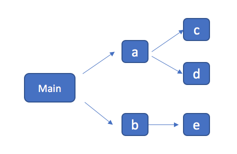
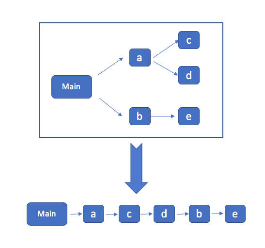

# webpack 源码分析 五： bundle.js 内容分析

我们来分析下webpack 打包完成的文件内容，我们的源码如下：

*a.js*

```js
import { log } from './b.js'
log('hello')
```
*b.js*

```js
export const log = function (m) {
  console.log(m)
}

export const error = function (m) {
  console.error(m)
}
```
为了减少干扰，这里我们没有用babel编译，如果你看到有 `module.exports` 而不是 `__webpack_exports__` 那是因为你启用了 babel 的 modules 导致的。

总共两个文件，内容非常简单。那么我们用webpack进行编译后，输出的文件内容如下：

```js
/******/ (function(modules) { // webpackBootstrap
/******/  // 这里省略一大段
/******/     return __webpack_require__(__webpack_require__.s = 0);
/******/ })
/************************************************************************/
/******/ ([
/* 0 */
/***/ (function(module, __webpack_exports__, __webpack_require__) {

"use strict";
Object.defineProperty(__webpack_exports__, "__esModule", { value: true });
/* harmony import */ var __WEBPACK_IMPORTED_MODULE_0__b_js__ = __webpack_require__(1);

Object(__WEBPACK_IMPORTED_MODULE_0__b_js__["a" /* log */])('hello')

/***/ }),
/* 1 */
/***/ (function(module, __webpack_exports__, __webpack_require__) {

"use strict";
const log = function (m) {
  console.log(m)
}
/* harmony export (immutable) */ __webpack_exports__["a"] = log;

const error = function (m) {
  console.error(m)
}
/* unused harmony export error */


/***/ })
/******/ ]);
```

为了看代码方便，暂时省略掉一段 webpack 生成的代码。 我们可以看到的是，整个代码是一个自执行的函数，其中这个函数接收的是一个数组，而数组中每一项都是我们的一个模块，这里我们有两个模块。不过这个模块的代码都是被一个函数包裹起来的。

**自执行函数**

这个自执行函数大概是这样的：

```js
(function (modules) {})([module0, module1])
```
其中 module0 和 module1 是我们的 a 和 b两个模块，不过也被一个函数包起来了。这段代码会把我们的模块放入一个数组，传给自执行函数，他来负责调用模块。

**模块代码**

那么我们的模块就变成了这样：

```js
(function(module, __webpack_exports__, __webpack_require__) {

"use strict";
Object.defineProperty(__webpack_exports__, "__esModule", { value: true });
/* harmony import */ var __WEBPACK_IMPORTED_MODULE_0__b_js__ = __webpack_require__(1);

Object(__WEBPACK_IMPORTED_MODULE_0__b_js__["a" /* log */])('hello')

/***/ })
```

这里函数带了几个参数，因为这些是模块系统需要用到的参数，比如我们的 `import` 被替换成了 `__webpack_require__`，那么这个函数就是通过 参数传进来的，所以不会报错。同样， `export` 被替换成了 `__webpack_exports__` 。

**webpack工具函数**

下面我们深入看一看前面被我们省略的，webpack自己生成的一段函数：

```js
(function(modules) { // webpackBootstrap
    // The module cache
    var installedModules = {};

    // The require function
    function __webpack_require__(moduleId) {

        // Check if module is in cache
        if(installedModules[moduleId]) {
            return installedModules[moduleId].exports;
        }
        // Create a new module (and put it into the cache)
        var module = installedModules[moduleId] = {
            i: moduleId,
            l: false,
            exports: {}
        };

        // Execute the module function
        modules[moduleId].call(module.exports, module, module.exports, __webpack_require__);

        // Flag the module as loaded
        module.l = true;

        // Return the exports of the module
        return module.exports;
    }


    // expose the modules object (__webpack_modules__)
    __webpack_require__.m = modules;

    // expose the module cache
    __webpack_require__.c = installedModules;

    // define getter function for harmony exports
    __webpack_require__.d = function(exports, name, getter) {
        if(!__webpack_require__.o(exports, name)) {
            Object.defineProperty(exports, name, {
                configurable: false,
                enumerable: true,
                get: getter
            });
        }
    };

    // getDefaultExport function for compatibility with non-harmony modules
    __webpack_require__.n = function(module) {
        var getter = module && module.__esModule ?
            function getDefault() { return module['default']; } :
            function getModuleExports() { return module; };
        __webpack_require__.d(getter, 'a', getter);
        return getter;
    };

    // Object.prototype.hasOwnProperty.call
    __webpack_require__.o = function(object, property) { return Object.prototype.hasOwnProperty.call(object, property); };

    // __webpack_public_path__
    __webpack_require__.p = "";

    // Load entry module and return exports
    return __webpack_require__(__webpack_require__.s = 0);
})
```

直接看起来会比较晕，我们把它缩写一下：

```js
(function(modules) {
    var installedModules = {};
    function __webpack_require__(moduleId) {}
    // Load entry module and return exports
    return __webpack_require__(__webpack_require__.s = 0);
})
```
这样就比较容易读懂了，这个函数 包含三部分内容
* 首先声明了一个 `installedModules` 作为缓存，这样如果发现我们 `import` 了一个之前已经 import 过的模块，则直接返回。
* 然后定义了 `__webpack_require__` 相关的函数
* 最后，直接调用了 ` __webpack_require__(__webpack_require__.s = 0)` 也就是直接调用了第 0 个模块，其实就是我们的入口文件，因此我们的整个JS代码就从这里开始运行起来。

`__webpack_require__` 就是给他一个moduleId，他会返回这个模块的内容。
```js
function __webpack_require__(moduleId) {
        // 看看有没有缓存，有的话就直接用了
        // Check if module is in cache
        if(installedModules[moduleId]) {
            return installedModules[moduleId].exports;
        }
        // Create a new module (and put it into the cache)
        // 如果没有的话，那么就先创建一个空的缓存
        var module = installedModules[moduleId] = {
            i: moduleId,
            l: false,
            exports: {}
        };

        // Execute the module function
        // 然后执行这个模块的代码，参数会传入模块系统相关的几个函数，把拿到的结果放到缓存中
        // 通过把 `module.exports`  传给模块，让他自己把自己放到缓存中。
        modules[moduleId].call(module.exports, module, module.exports, __webpack_require__);

        // Flag the module as loaded
        module.l = true;

        // Return the exports of the module
        // 最后得到了模块导出的内容，返回就可以了
        return module.exports;
    }
```

# webpack 对模块依赖的处理流程

前面我们讲到了，webpack 会通过 actorn 解析JS语法，并对 `require('xxx.js')` 做依赖收集

# 依赖关系

假设我们有如下的依赖关系：



在 `bundle.js` 内容分析的文章中，我们知道webpack最终打包出来的 `bundle.js` 中会把所有的模块变成一个数组，也就是把一颗树变成了一个数组。那么如果按照上图的依赖关系，最终打包的数组中的模块会是什么顺序呢？

其实从代码中很容易分析出来。因为webpack从entry开始，对每一个 module 都进行处理，碰到 `require` 之后就跳入到对应的 module 的处理，也就是递归的对这颗依赖树进行处理，这是典型的深度优先遍历的递归解法，而且是先序优先遍历。处理的过程是这样的

1. 处理 main.js，记录入口 [main]
2. 碰到 `require(a)`，记录 [main, a]
3. 进入到 `a` 模块，碰到语句 `require(c)`, 记录下来 [main, a, c]
4. 同理碰到 `require(d)`，记录下来 [main, a, c, d]
5. 返回到 main.js，下一句是 `require('b')`，记录下来 [main, a, c, d, b]
6. 进入模块 b，碰到语句 `require(e)`,记录下来[main, a, c, d, b, e]
7. 返回，结束

图解如下：


