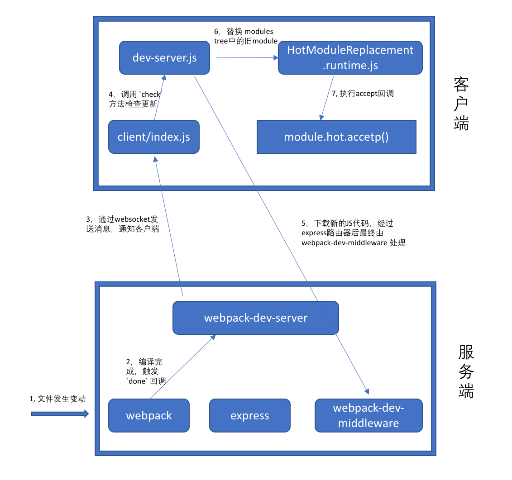
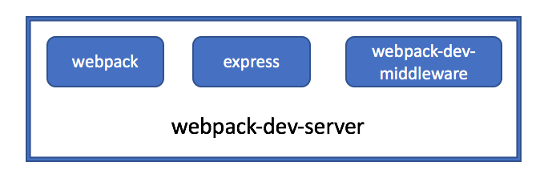
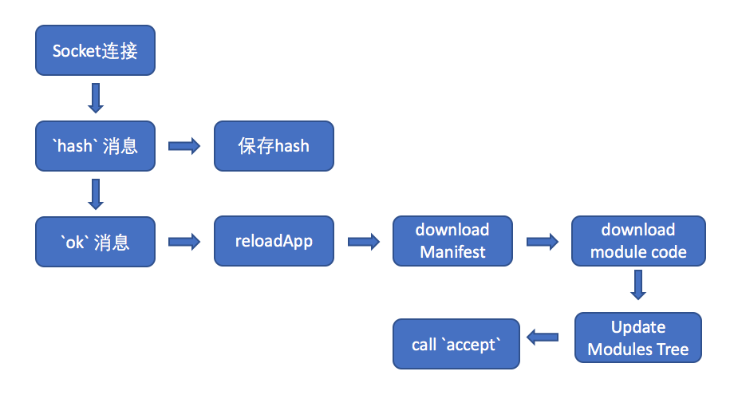

# style-loader 支持热更新

回到我们之前写的 `style-loader`，当时为了简单并没有支持热更新，这里我们为他加上热更新功能。

因为 `style-loader` 其实会处理 `css-loader` 传过来的 `locals`，也就是 css modules 的class映射。那么根据有没有启用 css modules，其实 `style-loader` 的热更新会分为两种情况。

第一种情况，启用了 css modules
如果我们已经在项目中配好了 HMR的代码，那么`style-loader`不作任何修改，就能默认支持热更新。为什么呢？
因为在webpack中，如果一个模块没有处理热更新的事件，那么会自动冒泡到他的父元素，直到被处理或者最终刷新浏览器。那么如果 `style-loader` 没有处理热更新的事件，会自动冒泡上去。以一个 React 项目为例，最终会冒泡到 `react-hot-loader`,他会重新渲染 `Root` 组件，然后我们的 `import styles from './styles.css'` 就会被重新执行一遍，所以CSS样式就被更新了。
当然，因为我们只负责插入 `style` 标签，而没有删除它，所以 `style` 标签会越来越多。为了保证性能，我们还是需要增加一行删除旧 style 标签的代码：

```js
if (module.hot) {
  module.hot.dispose(/**此处删除我们的旧style标签**/)
}
```
需要说明的是，在启用 css modules 的时候，`style-loader` 不处理热更新事件并不是投机取巧，而是必须不能处理。为什么呢？
因为如果 `style-loader` 自己处理了，比如把 `style` 标签的内容更新下，那么热更新就到此停止，父元素不会被更新，而且其实父元素依赖的 className 的列表已经变了，这样会导致样式出现错误。所以必须不能处理。
而如果没有启用  css modules，则父组件不会有直接依赖，这个时候只要 `style-loader` 自己更新下样式就好了。

第二种情况，如果没有启用 css modules
其实不作任何修改也可以！道理和上面的一样。然而，由于不作任何修改会冒泡到React根节点上，而其实只需要把 style 更新一下就好了，完全不用 React 组件做任何修改。所以在没有启用 css modules时，我们的 `style-loader` 就自己处理热更新，只需要在热更新的时候，把style的内容更新一下就好。

我们加上完整的热更新的代码如下：

```js
/**
 * style loader will insert css into DOM
 */
module.exports.pitch = function (request) {
  var result = [
    'var content=require(' + loaderUtils.stringifyRequest(this, '!!' + request) + ');',
    'var style = require(' + loaderUtils.stringifyRequest(this, '!' + path.join(__dirname, "add-style.js")) + ')(content);',
    'if (module.hot) {',
    '  if (content.locals) {', // 未启用 css modules， 则可以直接更新 style内容即可。如果启用了，因为还需要父组件更新，所以这里就不作处理，直接冒泡到父组件处理（style-loader被父组件重新调用了一次）
        '        module.hot.accept(' + loaderUtils.stringifyRequest(this, '!!' + request) + ', function() {',
    '     console.log("update new style")',
    '     style.innerHTML = require(' + loaderUtils.stringifyRequest(this, '!!' + request) + ');',
    '   })',
    '  }',
    '  module.hot.dispose(function () { console.log(style);style.remove() })',  // 无论如何，当dispose的时候记得把之前创建的 style 标签删除掉
    '}',
    'if(content.locals) module.exports = content.locals'
  ]
  return result.join(';')
}
```

事实上，这也就是官方的 `style-loader` 的做法：只有在启用 cssmodules 的时候才处理热更新，否则只负责删除，而把更新代码交给父组件做。


# HMR的原理

我们将分别从服务端（也就是nodejs）和客户端（也就是浏览器）两部分讲 HMR 热更新的原理。

我这里先画出一张流程图：




暂时看不懂没关系，下面我们详细讲解

## HMR 在server端的实现


之前我们讲到 webpack 是从 `webpack/bin/webpack` 开始启动的，但是如果我们使用了 `webpack-dev-server`，那么就是从 `webpack-dev-server/bin/webpack-dev-server.js` 启动的。



如上图所示，`webpack-dev-server` 包含了三部分：

* webpack, 负责编译代码
* webpack-dev-server，主要提供了 in-memory 内存文件系统，他会把webpack的outputFileSystem 替换成一个 inMemoryFileSystem，并且拦截全部的浏览器请求，从这个文件系统中把结果取出来返回。
* express，作为服务器


先来总结下 webpack 在server端进行热更新的流程

初始化阶段：
1, webpack-dev-server 初始化的时候
* var compiler = webpack(options) // 创建 webpack 实例
* 监听  compiler 也就是 webpack 的 `done` 事件
* 创建 express 实例
* 创建 WebpackDevMiddleware 实例
* 设置 express router，WebpackDevServer 会作为 express的一个中间件拦截所有请求

2, WebpackDevMiddleware 在初始化的时候
* 创建 一个 MemoryFileSystem  实例，替换掉 webpack.outputFileSystem，这样 webpack 编译出的文件其实都是存在内存中，而不是磁盘上
* 把对编译后的文件的请求，都重定向到上面创建的 `MemoryFileSystem` 中


热更新阶段：
1, webpack 监听文件变化，并完成编译
2, webpack-dev-server 监听 `done` 事件，并通过 `websocket` 向客户端发送消息
3, 客户端经过处理后，请求新的JS模块代码
4, WebpackDevServer 从 MemoryFileSystem 中取出代码，并返回


下面我们来看看代码：

初始化阶段，`webpack-dev-server.js` 会创建一个 `webpack` 实例：

```js
  let compiler;
  try {
    compiler = webpack(webpackOptions);
  } catch (e) {
  }
  let server;
  try {
    server = new Server(compiler, options);
  } catch (e) {
  }
```

接着，`webpack-dev-server/lib/Server.js` 会创建 express 和 WebpackDevMiddleware：

```js
function Server(compiler, options) {
  compiler.plugin('done', (stats) => {
    this._sendStats(this.sockets, stats.toJson(clientStats)); // 当完成编译的时候，就通过 websocket 发送给客户端一个消息（一个 `hash` 和 一个`ok`)
    this._stats = stats;
  });

  // Init express server
  const app = this.app = new express(); // eslint-disable-line

  // middleware for serving webpack bundle
  this.middleware = webpackDevMiddleware(compiler, options);
}

// 后面会有一行
app.use(this.middleware); // middleware会拦截所有请求，如果发现对应的请求是要请求 `dist` 中的文件，则会进行处理。
```

在热更新阶段，首先会触发这几行代码：

```js
  compiler.plugin('done', (stats) => {
    this._sendStats(this.sockets, stats.toJson(clientStats));
    this._stats = stats;
  });
```

`_sendStats` 会通过 websocket 给客户端发送两条消息。
客户端收到消息后，会去请求一个 json 配置文件，然后根据配置请求新的JS模块代码。这些请求都会被 `WebpackDevMiddleware` 拦截：

```js
function webpackDevMiddleware(req, res, next) {
        function goNext() {
            if(!context.options.serverSideRender) return next();
            return new Promise(function(resolve) {
                shared.ready(function() {
                    res.locals.webpackStats = context.webpackStats;
                    resolve(next());
                }, req);
            });
        }

        if(req.method !== "GET") {
            return goNext();
        }
        // 如果发现这个请求是 publicPath 中的文件内容，那么就从 fs 中取出内容并返回
        // 如果不是，那么 next，交给 `webpack-dev-server` 进行处理
        var filename = getFilenameFromUrl(context.options.publicPath, context.compiler, req.url);
        if(filename === false) return goNext();

        return new Promise(function(resolve) {
            shared.handleRequest(filename, processRequest, req);
            function processRequest() {
                // ...
                // server content
                var content = context.fs.readFileSync(filename);
                // ....
                if(res.send) res.send(content);
                else res.end(content);
                resolve();
            }
        });
    }

```


## HMR 在浏览器中的工作流程

webpack 在 启用HMR之后，会在server端（nodejs端）监听文件改动，并且一旦发生变动就把新的代码编译后发送到浏览器。浏览器中也会有HMR相关的代码，会通过socket和server保持通信，获取新代码并进行热替换。

这里我们先不看webpack在nodejs端是如何编译的，而是先看看在浏览器中是如何工作的。




HMR 工作流程：
1. client 和 server 建立一个 websocket 通信
2. 当有文件发生变动的时候，webpack编译文件，并通过 websocket 向client发送一条更新消息
3. client 根据收到的hash值，通过ajax获取一个 manifest 描述文件
4. client 根据manifest 获取新的JS模块的代码
5. 当取到新的JS代码之后，会更新 modules tree，（installedModules) 
6. 调用之前通过 `module.hot.accept` 注册好的回调，可能是loader提供的，也可能是你自己写的

这里以 用 `webpack-dev-server` 为例，当我们启用了 HMR 后，他会把我们的入口文件包一层，加上两个依赖：

```js
/***/ 0:
// 这个模块是新加的，我们的入口就是 index，而这里加了一个模块，引用了 index，并且额外加了两行 require
/***/ (function(module, exports, __webpack_require__) {
__webpack_require__("./node_modules/webpack-dev-server/client/index.js?http://localhost:8080");
__webpack_require__("./node_modules/webpack/hot/dev-server.js");
module.exports = __webpack_require__("./src/index.js");
/***/ })
/******/ })
```

其中:
* `client/index.js` 主要负责建立socket 通信，并在收到消息后调用对应的方法。
* `dev-server.js` 会调用 `module.hot.check` 方法，最终真正去做代码更新的，是在 `webpack/lib/HotModuleReplacement.runtime.js` 文件中。顺便说下，你在console中看到的HMR log，几乎都是在 `dev-server.js` 中输出的，有兴趣可以看下这个文件的源码。
我们的代码启用了 HMR 之后会多出9000行代码，很大一部分就是由于引入了 webpack 中 HMR runtime相关的代码导致的。

我们先从这个文件开始看：

1. 初始化的时候，client.js 会启动一个 socket 和 `webpack-dev-server` 建立连接，然后等待 `hash` 和 `ok` 消息。
2. 当有文件内容改动的时候，首先会收到 `webpack-dev-server` 发来的 `hash` 消息，得到新的 哈希值并保存起来。
3. 然后会立刻接收到 `ok` 消息，表示现在可以加载最新的代码了，于是进入 `reloadApp` 方法。
4. reloadApp -> check()
5. check => hotDownloadManifest, 这里会下载一个本次热更新的manifest文件，url就是用上面存的 `hash` 拼接出来的，大概这样：`8b52a72952cca784407e.hot-update.json`，结果大概长这样：`{"h":"8b52a72952cca784407e","c":{"0":true}}`。这里仔细观察会发现，每一次取到的manifest中的hash 都是上一次 `hash` 消息的值，这样应该是为了保证顺序。
6. hotDownloadManifest 下载完配置文件后，可以看到其中有一个 `h` ，这个hash就是我们等会要取编译后的新代码的地址，在 `hotEnsureUpdateChunk` 方法中最终会通过 jsonp的方式把新的代码加载进来。
7. 加载到新的模块代码后，会有一系列的对 依赖树 比如 `installedModules` 的更新操作。
8. 最终，在 `hotApply` 中会执行我们的 `module.hot.accept` 注册的回调函数

上面说的这些JS代码，都是被webpack打包在我们的 `bundle.js` 头部的代码。都是在浏览器中执行的。

我们来看一下代码：

首先，我们的bundle文件会被加入 `webpack-dev-server/client.js`，他会创建一个 socket 和 devserver 连接，监听事件，主要代码如下：

```js
const onSocketMsg = {
  hash: function msgHash(hash) { // 在 `hash` 事件触发的时候，把 `hash` 记下来
    currentHash = hash;
  },
  ok: function msgOk() { // `ok` 事件触发的时候，表示server已经便已完成最新代码，
    sendMsg('Ok');
    if (useWarningOverlay || useErrorOverlay) overlay.clear();
    if (initial) return initial = false; // eslint-disable-line no-return-assign
    reloadApp();
  }
};
// 省略
function reloadApp() {
  if (hot) {
    log.info('[WDS] App hot update...');
    // eslint-disable-next-line global-require
    const hotEmitter = require('webpack/hot/emitter');
    hotEmitter.emit('webpackHotUpdate', currentHash) // 触发这个事件的时候，会触发 `dev-server.js` 中的 check 方法
  }
// 省略
}
```

`dev-server.js` 中的check方法，最终会进入到这里：

```js
function hotCheck(apply) {
         if(hotStatus !== "idle") throw new Error("check() is only allowed in idle status");
         hotApplyOnUpdate = apply;
         hotSetStatus("check");
         return hotDownloadManifest(hotRequestTimeout).then(function(update) {
                // 取到了 manifest后，就可以通过jsonp 加载最新的模块的JS代码了  
                 hotEnsureUpdateChunk(chunkId);
         });
     }
```

加载JS的代码如下：
```js
function hotDownloadUpdateChunk(chunkId) { // eslint-disable-line no-unused-vars
        // 通过jsonp的方式加载
         var head = document.getElementsByTagName("head")[0];
         var script = document.createElement("script");
         script.type = "text/javascript";
         script.charset = "utf-8";
         script.src = __webpack_require__.p + "" + chunkId + "." + hotCurrentHash + ".hot-update.js";
         ;
         head.appendChild(script);
     }
```
加载到的代码如下：

```js
webpackHotUpdate(0,{

/***/ "./build/css-loader/index.js?modules!./src/style.css":
/***/ (function(module, exports, __webpack_require__) {

exports = module.exports = __webpack_require__("./build/css-loader/css-base.js")();
;exports.i(__webpack_require__("./src/global.css"));exports.push([module.i, "@import './global.css';\n\nh1 {\n  color: blue;\n}\n\n._input_css_12__avatar {\n  width: 100px;\n  height: 100px;\n  background-image: url('" + __webpack_require__("./src/avatar.jpeg") + "');\n  background-size: cover;\n}\n\n._input_css_12__avatar2 {\n  width: 100px;\n  height: 100px;\n  background-image: url('" + __webpack_require__("./src/m.png") + "');\n  background-size: cover;\n}\n", ""]);;exports.locals ={"avatar":"_input_css_12__avatar","avatar2":"_input_css_12__avatar2"}

/***/ })

})
//# sourceMappingURL=0.8b52a72952cca784407e.hot-update.js.map
```

到此为止，我们就已经得到了新模块的JS代码了，下面要做的就是调用对应的 `accept` 回调，这也是在 `hotApply` 方法的后面部分做的：

```js
for(moduleId in outdatedDependencies) {
             if(Object.prototype.hasOwnProperty.call(outdatedDependencies, moduleId)) {
                 module = installedModules[moduleId];
                 if(module) {
                     moduleOutdatedDependencies = outdatedDependencies[moduleId];
                     var callbacks = [];
                     for(i = 0; i < moduleOutdatedDependencies.length; i++) {
                         dependency = moduleOutdatedDependencies[i];
                         cb = module.hot._acceptedDependencies[dependency]; // 先去到所有对这个模块注册的 accept 回调
                         if(cb) {
                             if(callbacks.indexOf(cb) >= 0) continue;
                             callbacks.push(cb);
                         }
                     }
                     for(i = 0; i < callbacks.length; i++) {
                         cb = callbacks[i];
                         try {
                             cb(moduleOutdatedDependencies); // 挨个调用一遍
                         } // ...
                     }
                 }
             }
         }
```
